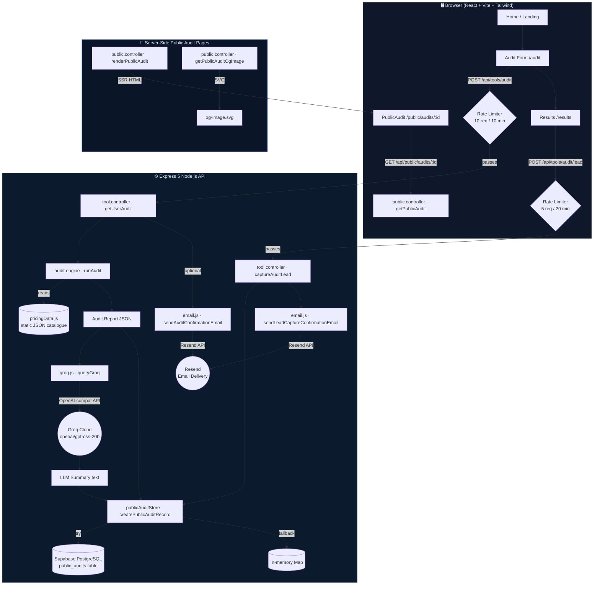

# Credex — Architecture

> AI-powered SaaS spend auditor: users enter their current AI tool subscriptions and get back a cost-optimised comparison report with an LLM-generated summary and a shareable public link.

---

## System Diagram



---

## Data Flow: User Input → Audit Result

Below is the full lifecycle of a single audit submission.

```
1. USER fills the Audit form
   └─ Selects tools from dropdown (populated via GET /api/tools/)
   └─ Enters: monthly spend, seat count, use-cases, email (optional)

2. BROWSER sends POST /api/tools/audit
   └─ Payload: { auditItems[], totalMonthlySpend, totalAnnualSpend,
                 companyName?, email? }

3. RATE LIMITER (middleware)
   └─ Checks IP-keyed in-memory Map
   └─ Limit: 10 requests per 10 minutes
   └─ Returns 429 + X-RateLimit-* headers on breach

4. CONTROLLER (getUserAudit)
   └─ Delegates to audit.engine.runAudit()

5. AUDIT ENGINE (pure, synchronous, no I/O)
   For each auditItem:
   ├─ Looks up tool in pricingData (static JSON catalogue)
   ├─ Determines type: API tool (per-token) vs Subscription tool (per-seat)
   │
   ├─ API tool path:
   │   └─ Estimates token volume from current spend + per-MTok rate
   │   └─ Finds cheaper API alternatives with matching use-cases
   │
   └─ Subscription tool path:
       ├─ findAlternativesWithin  → cheaper plans on the same tool
       └─ findAlternativesOutside → cheaper plans on other tools
   
   Returns: { summary, toolAudits[], overallRecommendations[] }

6. GROQ LLM (async, non-blocking)
   └─ Serialises report JSON → prompt
   └─ Calls Groq Cloud (openai-compat endpoint, model: openai/gpt-oss-20b)
   └─ Returns ~100-word personalised summary paragraph
   └─ Failure is swallowed; audit proceeds without summary

7. PERSISTENCE (publicAuditStore)
   └─ Generates 12-char public ID (UUID-derived)
   └─ Builds redacted publicReport (safe to share)
   └─ Tries Supabase INSERT → on error falls back to in-memory Map
   └─ Returns { publicId, publicUrl, storage: "supabase"|"memory" }

8. EMAIL (Resend, async, fire-and-forget)
   └─ Skipped if no email provided or RESEND_API_KEY not configured
   └─ Sends HTML + plain-text audit confirmation with top-3 savings

9. CONTROLLER responds to browser
   └─ { data: report, LLMResponse, meta, share: { publicId, publicUrl } }

10. BROWSER renders /results
    └─ Displays per-tool breakdowns, alternatives, LLM summary
    └─ Shows shareable public link

11. (Optional) USER clicks "I want help" or "Notify me"
    └─ POST /api/tools/audit/lead
    └─ Updates Supabase record with interestType + lead email
    └─ Sends lead-capture confirmation email via Resend

12. ANYONE visits /public/audits/:id
    └─ Server renders SSR HTML page (no React needed)
    └─ og-image.svg is generated server-side for social previews
```

---

## Why This Stack?

| Layer | Choice | Rationale |
|---|---|---|
| **Frontend framework** | React 19 + Vite 7 | Fastest local DX; tree-shaking keeps bundle small; TypeScript throughout |
| **Styling** | Tailwind CSS v4 | Utility-first works well with a component-heavy audit form; v4's CSS-native engine needs zero PostCSS config |
| **Routing** | React Router v7 | Mature; supports data-loading patterns and nested layouts without a full meta-framework |
| **HTTP client** | Axios | Interceptors make it easy to attach base URLs and handle 429 responses globally |
| **Toast notifications** | react-hot-toast | Zero-config, lightweight; integrates in a single component |
| **Backend runtime** | Node.js + Express 5 | Async-first, huge ecosystem, native ESM support; Express 5 adds promise-aware route handling out of the box |
| **Rate limiting** | Custom in-memory middleware | No extra dependency; sliding-window semantics per IP; trivially replaceable with Redis later |
| **Pricing data** | Static JSON module (`pricingData.js`) | No database round-trip for read-only catalogue; hot-reloadable during dev; versioned with the codebase |
| **Audit engine** | Pure JS functions | Zero I/O → synchronous, easily testable, no mocking required |
| **LLM** | Groq Cloud (`openai/gpt-oss-20b`) via OpenAI-compatible SDK | Sub-second inference; OpenAI SDK compatibility means one-line provider swap; free-tier friendly |
| **Database** | Supabase (PostgreSQL) | Managed Postgres with a generous free tier; real-time and auth available if needed later; JS client is excellent |
| **In-memory fallback** | `Map` in Node process | Zero-config fallback when Supabase creds are absent; good for local dev and CI |
| **Email** | Resend | Simple REST API; great deliverability; HTML + text payloads; tagging for analytics; degrades gracefully when key is absent |
| **Public audit pages** | Server-rendered HTML strings | No client JS required for sharing; canonical URLs + og-image SVG for unfurl previews; SEO-friendly |

---

## What Would Change at 10 000 Audits / Day

At ~7 audits/minute (sustained) the current single-process, single-region design hits several ceilings. Here is a prioritised list of changes:

### 1. Rate Limiting → Redis-backed
The current `Map` is per-process and resets on restart. At scale, use **Redis** (e.g. Upstash) with a sliding-window counter shared across all instances.

```
rateLimiter: Map (process-local)  →  Redis INCR + EXPIRE
```

### 2. Audit Engine → Worker Threads or Job Queue
The audit engine is CPU-bound O(n × tools). At high concurrency it blocks the event loop. Move heavy audits to:
- **Worker threads** for immediate < 1 s jobs, or  
- **BullMQ + Redis** for a proper queue with retries, dead-letter, and progress events.

### 3. LLM Calls → Queue + Caching
Groq calls are the slowest step (~500 ms–2 s). At 10 k/day:
- Add a **job queue** (BullMQ) so LLM jobs run in the background; results are written to the DB and pushed via a WebSocket or polling endpoint.
- Cache identical report hashes (SHA-256 of normalised `auditItems`) in Redis to skip redundant Groq calls.

### 4. Storage → Supabase Connection Pool + Read Replicas
Replace direct `@supabase/supabase-js` (which uses the REST API) with a **direct PostgreSQL connection via `pg` + `pgBouncer`** connection pooling. Add a read replica for `getPublicAuditRecord` queries.

### 5. In-Memory Audit Cache → Redis
The `memoryAuditStore` Map is great for zero-config environments but evicts on restart and doesn't share across replicas. Replace with a **Redis cache** (TTL ~24 h).

### 6. Horizontal Scaling → Containerisation
Wrap the Express server in a **Docker container** and deploy behind a load balancer (e.g. Cloud Run, Fly.io, or ECS). All stateful concerns (rate limits, audit cache) must be off-process (Redis) first.

### 7. Email → Async Queue
`sendAuditConfirmationEmail` is awaited inline today (fire-and-forget in practice because errors are caught). At scale, push email jobs to **BullMQ** to avoid any risk of response latency from the Resend API.

### 8. Pricing Catalogue → Database Table
A static JSON file works for < 100 tools but becomes a deployment bottleneck. Move `pricingData` to a `tools` + `plans` Postgres table with an admin UI or a simple migration script, and cache in Redis with a short TTL.

### 9. Observability
Add **structured JSON logging** (e.g. `pino`), **distributed tracing** (OpenTelemetry → Grafana Tempo), and a metrics dashboard (Prometheus + Grafana) to track p95 audit latency, Groq error rates, and DB query times.

---

## Repository Layout

```
credex/
├── backend/
│   └── src/
│       ├── server.js              # Express app entry-point, CORS, trust proxy
│       ├── controller/
│       │   ├── tool.controller.js # Audit submission + lead capture handlers
│       │   └── public.controller.js # SSR public audit pages + OG image
│       ├── routes/
│       │   ├── tool.routes.js     # /api/tools/* with per-route rate limits
│       │   └── public.routes.js   # /public/audits/* and /api/public/*
│       ├── middleware/
│       │   └── rateLimiter.js     # Custom IP-keyed sliding-window limiter
│       ├── utils/
│       │   ├── audit.engine.js    # Pure cost-comparison logic
│       │   ├── groq.js            # Groq LLM client (OpenAI-compat)
│       │   ├── email.js           # Resend HTML/text email builders
│       │   ├── publicAudit.js     # Public report builder + SSR page renderer
│       │   ├── url.js             # Origin resolution helpers
│       │   └── ENV.js             # Validated environment config
│       ├── db/
│       │   ├── supabase.js        # Supabase client (graceful no-op if unconfigured)
│       │   ├── publicAuditStore.js # Supabase ↔ memory fallback CRUD
│       │   └── public_audits.sql  # Schema migration
│       └── data/
│           └── pricingData.js     # Static AI tool & plan catalogue
└── frontend/
    └── src/
        ├── App.tsx                # Router shell + health-check ping
        ├── pages/
        │   ├── Home.tsx           # Landing page
        │   ├── Audit.tsx          # Multi-step audit form
        │   ├── Results.tsx        # Report display + share + lead capture
        │   └── PublicAudit.tsx    # Shared read-only audit viewer
        ├── components/            # Reusable UI (layout, landing sections)
        └── lib/
            └── axios.ts           # Pre-configured axios instance
```
