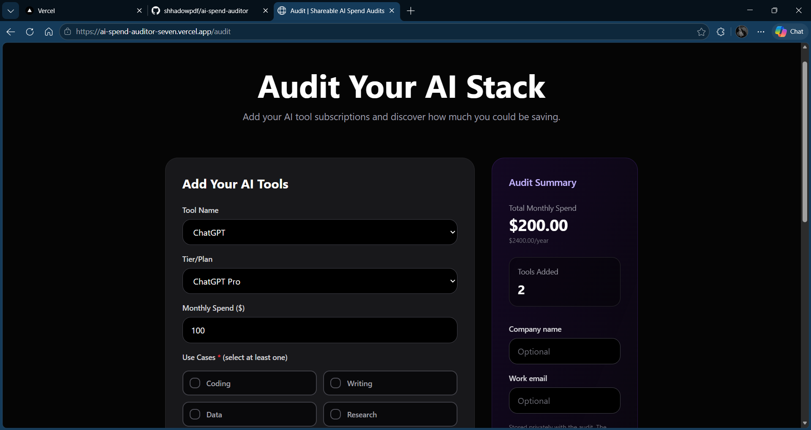
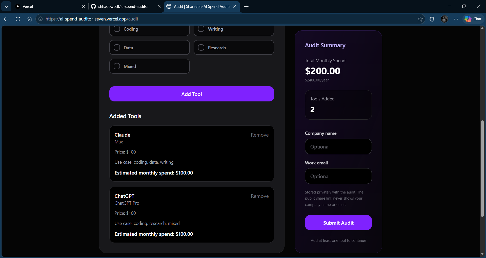
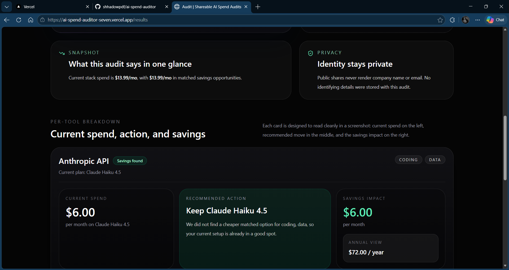
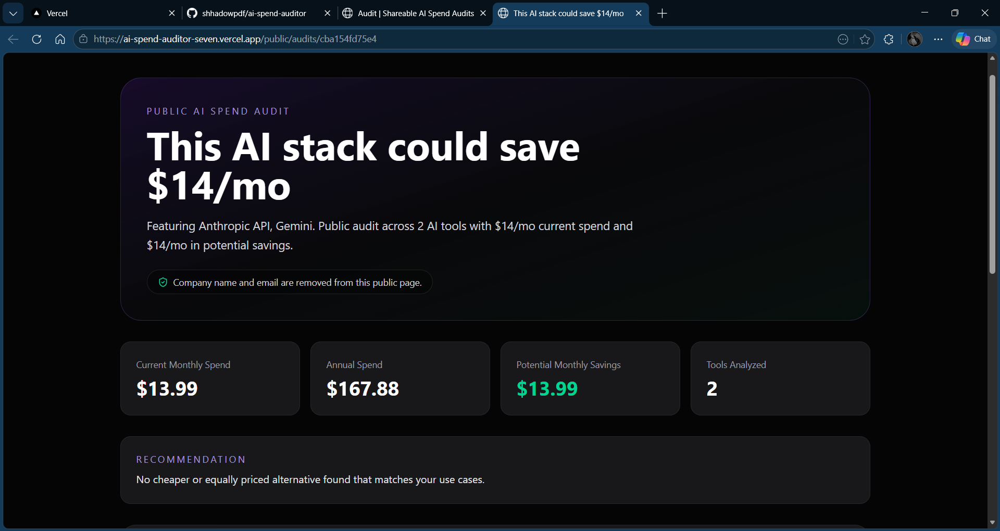
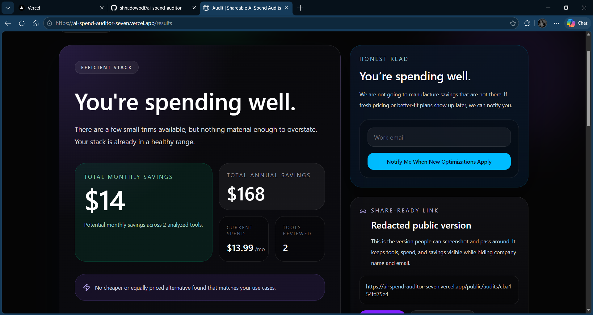

# Credex — AI SaaS Spend Auditor

Credex scans a startup's AI tool stack, finds overlapping subscriptions and cheaper
plan alternatives, and returns a plain-English audit with estimated monthly savings —
in 60 seconds, no sign-up required. It's built for seed-to-Series-A engineering teams
who are paying for AI tools nobody is tracking.

> **Live demo:** _[https://ai-spend-auditor-seven.vercel.app/]_  

---

## Screenshots

**1. Audit form**






**2. Results page**





**3. Shareable public audit link**




---

## Quick Start

### Prerequisites

- Node.js 18+
- A [Groq](https://console.groq.com) API key (free tier works)
- A [Supabase](https://supabase.com) project (free tier works — or skip it, the app
  falls back to in-memory storage)
- A [Resend](https://resend.com) API key for confirmation emails (optional)

---

### 1. Clone

```bash
git clone https://github.com/your-username/credex.git
cd credex
```

### 2. Backend

```bash
cd backend
npm install
```

Create `backend/.env`:

```env
PORT=3000
NODE_ENV=development
PUBLIC_URL=http://localhost:5173

GROQ_API_KEY=your_groq_key

# Optional — app works without Supabase (falls back to in-memory)
SUPABASE_URL=your_supabase_url
SUPABASE_ANON_KEY=your_supabase_anon_key
SUPABASE_SERVICE_ROLE_KEY=your_supabase_service_role_key

# Optional — confirmation emails are silently skipped without this
RESEND_API_KEY=your_resend_key

# Savings threshold that flags a lead as high-intent
AUDIT_HIGH_SAVINGS_MONTHLY_THRESHOLD=500
```

If using Supabase, run the schema migration:

```bash
create extension if not exists pgcrypto;

create table if not exists public.public_audits (
  id uuid primary key default gen_random_uuid(),
  public_id text not null unique,
  public_url text not null,
  company_name text,
  email text,
  report jsonb not null,
  public_report jsonb not null,
  llm_response text,
  created_at timestamptz not null default timezone('utc', now())
);

create index if not exists public_audits_public_id_idx
  on public.public_audits (public_id);

```

Start the dev server:

```bash
npm run dev        # runs on http://localhost:3000
```

### 3. Frontend

```bash
cd ../frontend
npm install
```

Create `frontend/.env`:

```env
VITE_API_URL=http://localhost:3000
```

```bash
npm run dev        # runs on http://localhost:5173
```

---

### Deploy

| Layer | Platform | Notes |
|---|---|---|
| Frontend | [Vercel](https://vercel.com) | `frontend/` is the root; `vercel.json` handles SPA rewrites |
| Backend | [Vercel](https://vercel.com) | `backend/` is a separate Vercel project; `npm start` is the start command |
| Database | Supabase | Free tier is sufficient for early traffic |

Set this environment variable in the **frontend** Vercel project:

```
VITE_API_URL=https://your-backend.vercel.app
```

Set all vars from `backend/.env` in the **backend** Vercel project's Environment Variables settings.

---

## Decisions

### 1. No sign-up to run an audit
**Trade-off:** Losing a persistent user record in exchange for zero friction at the top
of the funnel.  
**Why:** The target user is a CTO or senior engineer who will bounce at a sign-up wall.
The audit itself is the lead magnet. Email is captured *after* the user sees real
savings, when they have a reason to share contact info.

### 2. Groq over OpenAI for the LLM summary
**Trade-off:** Less model flexibility, vendor lock-in to Groq's API.  
**Why:** Groq's free tier is generous enough to cover early traffic at $0. The LLM
summary is a UX enhancement, not the core product — a slow or paid model here would
burn budget on a non-critical path. The audit engine itself is deterministic and runs
without any LLM.

### 3. In-memory fallback when Supabase is unavailable
**Trade-off:** Shareable links break on server restart if Supabase isn't configured.  
**Why:** The app should work end-to-end in a local dev environment with zero external
dependencies. Early demos and Show HN traffic shouldn't require a database to be
running. Once a `publicId` is in Supabase it survives restarts; in-memory is only
ever a local dev convenience.

### 4. Shareable link generated on every audit (not opt-in)
**Trade-off:** Every audit creates a record, even for users who never share it.  
**Why:** The shareable link is the viral loop. If it requires an extra click to
generate, most users won't bother. Auto-generating it means the share option is always
ready at the end of the results page — zero friction for the behaviour we want to
encourage.

### 5. Pricing data hardcoded in a JS file, not a database table
**Trade-off:** Adding a new tool or updating a price requires a code deploy.  
**Why:** At 35 tools, a DB-backed admin panel is over-engineering. A flat JS object is
grep-able, diff-able, and requires no migration. The right time to move this to a
database is when the catalogue exceeds ~100 tools or when non-engineers need to update
it — neither is true yet.

---

## Project Structure

```
credex/
├── backend/
│   └── src/
│       ├── controller/     # Route handlers (audit, lead capture, public audit)
│       ├── data/           # Hardcoded pricing catalogue
│       ├── db/             # Supabase client + public_audits store
│       ├── middleware/      # Rate limiting
│       ├── routes/         # Express route definitions
│       ├── tests/          # Node built-in test runner
│       └── utils/          # Audit engine, Groq client, email, URL helpers
└── frontend/
    └── src/
        ├── components/     # Shared UI components
        ├── pages/          # Audit form, Results, Public audit view
        └── lib/            # API client
```

---

## Running Tests

```bash
cd backend
npm test
```

Uses Node's built-in `node:test` runner — no Jest, no Mocha, no extra dependencies.
